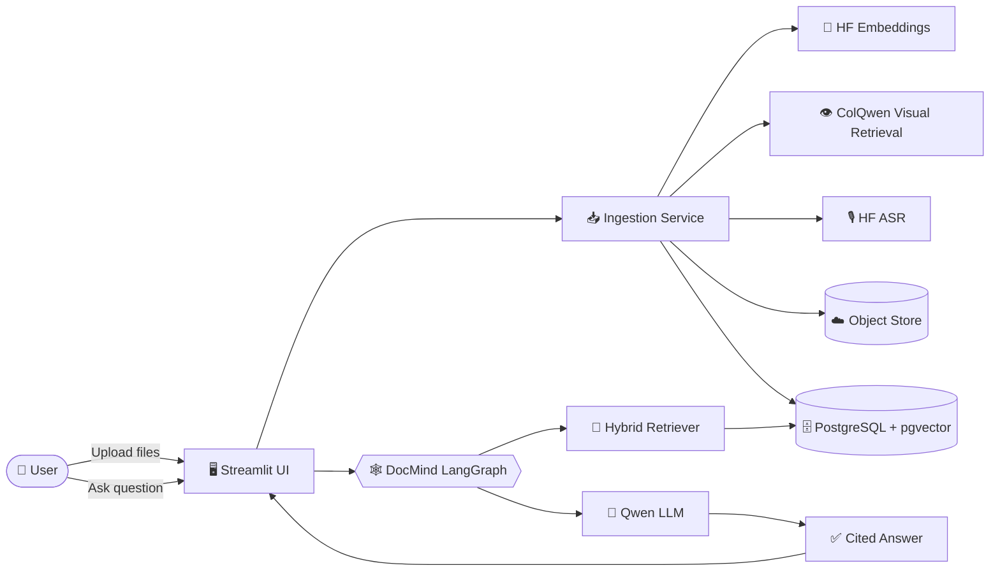

<div align="center">


<br/>

<a href="https://multimodalragsystemdocmind-5fmcbznmemee4llssrmf6n.streamlit.app/">
  
</a>

<br/><br/>

<!-- Badges -->
<a href="https://multimodalragsystemdocmind-5fmcbznmemee4llssrmf6n.streamlit.app/"></a>
<a href="https://github.com/mudassar2224/Multimodal_RAGSystem_DOC_MIND"></a>
<a href="https://github.com/mudassar2224/Multimodal_RAGSystem_DOC_MIND/stargazers"></a>
<a href="https://github.com/mudassar2224/Multimodal_RAGSystem_DOC_MIND/network/members"></a>
<a href="https://github.com/mudassar2224/Multimodal_RAGSystem_DOC_MIND/commits/main"></a>

<br/>


</div>


## ✨ What is DocMind?

> **DocMind** is a persistent, source-grounded **multimodal Retrieval-Augmented Generation (RAG)** system. Drop in documents, spreadsheets, slides, images, audio, or video — ask questions in plain English — and get answers grounded in **cited evidence**, not hallucinated guesses.

Every conversation is a private thread with its own indexed knowledge base. Every answer comes with **page numbers, slide numbers, timestamps, or frame references** pointing straight back to the source.

<div align="center">

### 🎬 See it in action


*(Replace this GIF with your own screen recording — see [📸 Adding Your Own Demo](#-adding-your-own-demo) below)*

</div>

---

## 🚀 Live Demo

<div align="center">

### 👉 **[multimodalragsystemdocmind.streamlit.app](https://multimodalragsystemdocmind-5fmcbznmemee4llssrmf6n.streamlit.app/)** 👈


</div>

---

## 🌈 Features

| | Feature | Description |
|---|---|---|
| 📄 | **Multi-format ingestion** | PDF, DOCX, PPTX, XLSX, TXT, MD, CSV, JSON |
| 🖼️ | **Image understanding** | Upload screenshots, photos, diagrams — ask what's in them |
| 🎵 | **Audio transcription** | Automatic speech-to-text via Hugging Face ASR |
| 🎬 | **Video comprehension** | Frame extraction + audio transcript, fused for full video Q&A |
| 🔍 | **Hybrid retrieval** | Combines dense text embeddings + visual (ColQwen) retrieval |
| 🕸️ | **LangGraph orchestration** | A real agentic graph workflow, not a single prompt chain |
| 📌 | **Cited, source-grounded answers** | Every answer links back to the exact page / slide / timestamp |
| 🧵 | **Persistent per-thread memory** | Each conversation keeps its own indexed knowledge base |
| ▶️ | **In-app file playback** | Play video/audio, preview PDFs/images/text right inside the chat |
| ☁️ | **Hosted inference only** | No local GPU needed — runs entirely on Hugging Face-hosted models |

---

## 🏗️ Architecture



---

## 🧰 Tech Stack

<div align="center">


</div>

---

## ⚡ Quick Start

```bash
# 1️⃣ Clone the repo
git clone https://github.com/mudassar2224/Multimodal_RAGSystem_DOC_MIND.git
cd Multimodal_RAGSystem_DOC_MIND

# 2️⃣ Install dependencies (uv is used for this project)
uv sync

# 3️⃣ Configure environment variables
cp .env.example .env
# → add your HF_TOKEN, DATABASE_URL, object storage credentials, etc.

# 4️⃣ Run the app
streamlit run app.py
```

<div align="center">

</div>

---

## 🔑 Environment Variables

| Variable | Purpose |
|---|---|
| `HF_TOKEN` | Hugging Face inference API token |
| `QWEN_MODEL` | Qwen LLM model ID (generation) |
| `TEXT_EMBEDDING_MODEL` | Embedding model for hybrid retrieval |
| `VISUAL_RETRIEVAL_MODEL` | ColQwen model for visual retrieval |
| `ASR_MODEL` | Speech-to-text model for audio/video |
| `DATABASE_URL` | PostgreSQL (pgvector) connection string |
| `OBJECT_STORAGE_BACKEND` / `S3_*` | Object storage config for raw file storage |

---

## 📸 Adding Your Own Demo

Want this README to show off *your* actual app instead of placeholder GIFs?

1. Record a short screen capture (e.g. with [ScreenToGif](https://www.screentogif.com/) or [Kap](https://getkap.co/)) of a real Q&A across a PDF + image + audio file.
2. Drop it into a `/docs/assets/` folder in the repo.
3. Replace the placeholder `` tags above with:
   ```md
   
   ```

---

## 🗺️ Roadmap

- [x] Multimodal ingestion (PDF, DOCX, PPTX, XLSX, images, audio, video)
- [x] Hybrid text + visual retrieval
- [x] Cited, source-grounded answers
- [x] In-app file preview & playback
- [ ] Legacy `.ppt` / `.doc` / `.xls` ingestion support
- [ ] Multi-user auth & shared workspaces
- [ ] Streaming token-by-token answers

---

## 🤝 Contributing

Contributions, issues, and feature requests are welcome!

```bash
# Fork → branch → commit → PR 🚀
git checkout -b feature/amazing-idea
git commit -m "✨ Add amazing idea"
git push origin feature/amazing-idea
```

---

## 👤 Author

<div align="center">

**Muhammad Mudassar**
Final-year BS Artificial Intelligence @ UMT Lahore · Building toward LLM Engineering

<a href="https://github.com/mudassar2224"></a>
<a href="https://linkedin.com/in/muhmmad-mudassar-656384342"></a>
<a href="https://huggingface.co/Maliktg5"></a>

</div>

---

<div align="center">

### ⭐ If DocMind helped you, consider giving the repo a star!


</div>
